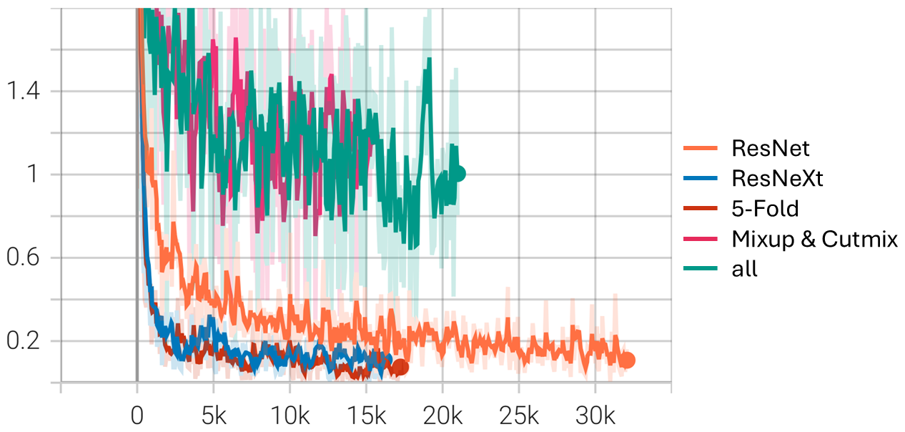
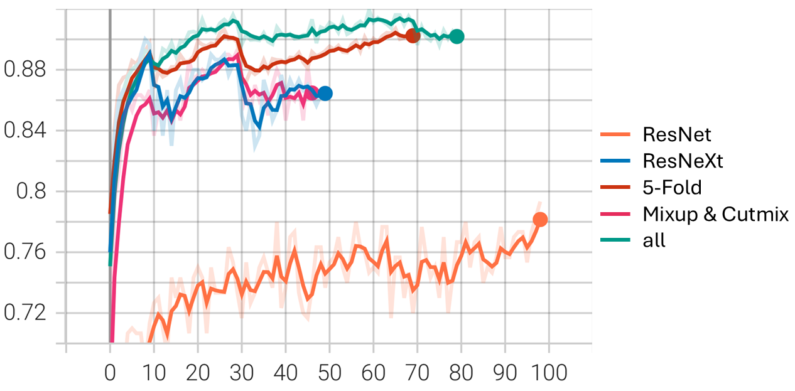

# NYCU DLVR HW1: Image Classification

>[!NOTE]
> Author: 何義翔 (Yi-Hsiang, Ho)  
> StudentID: 111550106

## Introduction

This task is to classify creature images into 100 different categories using ResNet. The datasets are from this course, including 21,024 images for training/validation and 2,344 for testing. The core idea of this work is to leverage advanced data augmentation techniques, MixUp and CutMix, and ensemble learning to improve the model’s performance. ResNeXt is chosen to be the backbone of the model.

## Requirement

- Python 3.12
- PyTorch 2.6.0 with CUDA 12.4
- TensorBoard
- tqdm
- pandas

It is recommended to use virtual environment. You can use Conda, venv, etc. The following commands are for Conda.

```bash
conda create --name DLVR_HW1 python=3.12
conda activate DLVR_HW1
pip install torch torchvision torchaudio tensorboard tqdm pandas
```

## How to use

### Train

To train the model with default settings (in NVIDIA GeForce RTX 4090, each folds needs about 2-3 hours to train.):

```bash
python main.py --train_crossVal
```

To test the ensemble model:

```bash
python main.py --test_ensemble
```

You can also specify `--device` to set the GPU ID, `--fold_begin` and `--fold_end` to set the range of folds in training time, this allow you to train on multiple GPUs. E.g.,

```bash
python main.py --train_crossVal --device=0 --fold_begin=0 --fold_end=2  # Run on GPU 0
python main.py --train_crossVal --device=1 --fold_begin=2 --fold_end=5  # Run on GPU 1
```

For more information about all arguments, please use `--help`.

## Performance

**Accuracy results of different models.** "Val" refers to validation accuracy. "Test pub." and "Test priv." refer to public and private test set accuracy, respectively.

| Method         | Val      | Test pub.   | Test priv.   |
| -------------- | :------: | :---------: | :----------: |
| ResNeXt        | 0.9000   | 0.9317      | 0.9266       |
| 5-Fold         | 1.0000   | 0.9386      | 0.9292       |
| Mixup & Cutmix | 0.8933   | 0.9497      | 0.9437       |
| all            | 1.0000   | 0.9522      | 0.9514       |

**Training loss curve.** Only a single sub-model is selected for 5-Fold and All to better visualize.



**Validation accuracy curve.** The selection of those two curve is the same as above.



For more detail, please see the [report](/report/report.pdf).

## Repository Structure

```
├── dataset.py               # Dataset loading and preprocessing
├── model.py                 # Model architecture definitions
├── main.py                  # Main training script
├── utils.py                 # Utility functions
├── exp_src/                 # Experimental implementations
│   ├── loss.py
│   ├── main_crossVal.py     # Cross-validation implementation
│   ├── main_focal.py        # Focal loss implementation
│   ├── main_mixup_cutmix.py # MixUp and CutMix augmentations
│   └── ...
├── data/                    # Please place your dataset here
│   ├── train/               # Training set
│   │   ├── 0/               # Seperate the image using label as directory name
│   │   ├── 1/
│   │   ├── 2/
│   │   └── ...
│   ├── val/                 # Validation set, the format is the same as train/
│   └── test/                # Testing set
└── report/                  # Project report and documentation
```

## License
This project is under MIT license, please see [LICENSE](LICENSE) for more detail.
